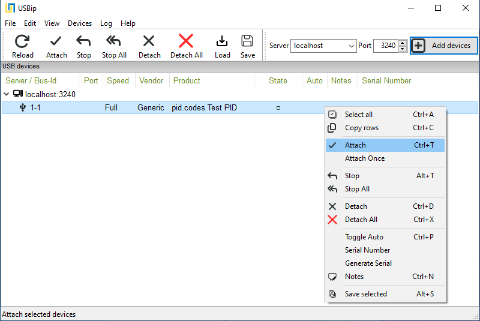

# USBIP - Python library

Create **virtual USB devices** and write **USB host drivers** for them, in pure Python.

[USB/IP](https://docs.kernel.org/usb/usbip_protocol.html) is a protocol born in the
Linux kernel. Its intended job is to *export* a computer's real USB devices, so another
machine can use them over the network. It has been in the mainline kernel for years.

But the protocol has a second, unintended power: the traffic on the wire is just USB
requests over TCP, so an ordinary program can answer those requests and *become* a USB
device - no hardware, no kernel code. The kernel side always existed; a standard
library for this side did not. This library fills that gap:

- **Device API** (`usbip.device`, `usbip.function`) - your program *is* a USB device:
  keyboard, serial port, disk, webcam, sound card, or anything you define yourself.
- **Host API** (`usbip.open`, `usbip.attach`) - your program *talks to* such a device,
  shaped like libusb, with no kernel driver and no root.


See [API reference and guide](https://jabezwinston.github.io/usbip-python/) for more details.

## Use cases

- **Test automation** - exercise a host application against a scripted USB device in
  CI, with no hardware on the runner.
- **AI in the loop** - an agent can build, plug, probe and fix a USB device or a host
  application entirely in software.
- **Reverse engineering** - re-create a device from a captured trace and refine it
  until the original driver accepts it.
- **Develop before the hardware exists** - write and test the host software against a
  virtual model of the device.
- **Emulate old or discontinued hardware** whose driver you still need to run.
- **Learn USB** by building devices and watching every transfer in Wireshark
  (set `USBIP_PCAPNG=1` on any program using this library).

## Setup

```bash
pip install usbip
```

Requires Python 3.8+ and nothing else. The import name is `usbip`.

## Creating a virtual device

A complete device - one vendor interface, two bulk endpoints, echoing back whatever
the host sends. WinUSB is advertised so Windows binds a driver automatically:

```python
from usbip import In, Interface, Out, USBDevice
from usbip.transport import USBIP

class VendorBulk(Interface):
    bInterfaceClass = 0xFF    # vendor-specific
    bulk_out = Out(0x01, "bulk", mps=64)  # host   -> device
    bulk_in  = In(0x81, "bulk", mps=64)   # device -> host

dev = USBDevice(0x1209, 0x0004, manufacturer="USB over IP", product="My 1st Device", serial="0004")
fn = dev.add(VendorBulk())
dev.enable_winusb()        # Skip driver install on Windows

transport = USBIP("0.0.0.0", 3240)
dev.plug(via=transport)                  # serve and return
while True:                              # echo everything back
    data = fn.bulk_out.read(timeout=1.0)
    if data:
        fn.bulk_in.write(data)
```

Run it with `python3 my_device.py`.

## Attaching it

The script now serves the device on TCP port 3240 and waits. Nothing appears yet:
your program is the USB/IP *server*, and the operating system is the *client* that
imports the device. That import step is the only part that differs per OS.

On Linux, the client is already in the kernel:

```bash
sudo modprobe vhci-hcd                 # once per boot
sudo usbip attach -r 127.0.0.1 -b 1-1
lsusb                 # Check if your device is listed
```

(Detach with `sudo usbip detach -p 00`.)

On Windows, install [usbip-win2](https://github.com/vadimgrn/usbip-win2) and attach
with its GUI:



or from a terminal: `usbip.exe attach -r <ip> -b 1-1`. Because the device above
advertises WinUSB, no driver hunt follows - it is immediately usable from libusb apps.

On an OS without a USB/IP client (macOS has none in-box), use
[USBIP for microcontrollers](https://github.com/jabezwinston/usbip-for-uc): a small
board that attaches over the network and re-presents the device on a real USB port,
which any machine sees as plain USB.

## A COM port in a few lines

Device classes are built in, so common devices take almost no code. A serial port that
echoes what you type:

```python
import time
from usbip.classes.device import CDCACM
from usbip.device import USBDevice

def on_rx(port, data):
    port.write(bytes(data))                 # echo back to the host

dev = USBDevice(0x1209, 0x0001, product="My Serial Port")
dev.add(CDCACM(on_rx=on_rx))

dev.plug()     # local USB/IP by default
while True:
    time.sleep(3600)   # the class handles everything
```

Attach it and a serial port appears - `/dev/ttyACM0` on Linux, a `COMx` port on
Windows; open it with any terminal program. The other built-in classes are **HID**
(keyboard/mouse/raw), **MSC** (disk), **UVC** (webcam), **UAC** (sound card), **DFU**
(firmware upgrade), **MTP** (file transfer) and **Bluetooth** (HCI dongle) - see
[`examples/`](examples/) for a runnable program per class (some need
`pip install "usbip[examples]"`), and the
[guide](https://jabezwinston.github.io/usbip-python/) for what each one turns into
per OS.

## Writing a host driver

The host API is shaped like libusb, so the learning curve is minimal. It imports a
device and drives it from your own process - no kernel client, no root, works on any
OS including macOS:

```python
import usbip

with usbip.open(0x1209, 0x0004) as dev:  # local server; usbip.attach() for remote
    dev.bulk_out(0x01, b"hello")
    print(dev.bulk_in(0x81, 64))    # -> b"hello" (the echo device above)
```

`usbip.use(usbip.Loopback())` runs a device and a driver in the same process with no
network at all - handy for tests.