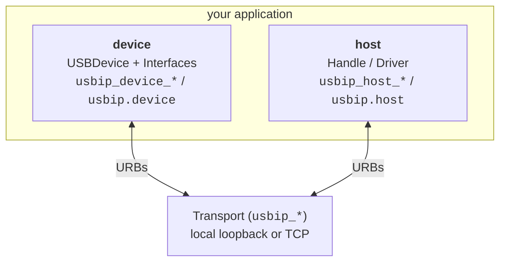

# Components

The USBIP Python library is layered by role, and the name prefix tells you which layer a symbol
belongs to:

| Layer | Python | C prefix | Responsibility |
|-------|--------|----------|----------------|
| [Transport](transport.md) | `usbip.USBIP`, `Loopback` | `usbip_*` | the USB/IP wire (local by default) |
| [Device](device.md) | `USBDevice`, `Interface`, `Endpoint` | `usbip_device_*` | build a virtual device |
| [Device classes](classes.md) | `usbip.classes.device.*` | `classes/*.h` | ready-made interfaces on top of the device API |
| [Host](host.md) | `open`, `Handle`, `Driver` | `usbip_host_*` | drive a device |

A **device** is a `USBDevice` with one or more `Interface`s; each interface
owns `Endpoint`s (byte pipes). A **host** opens a device and runs transfers, or binds
a reusable `Driver` by class code. The **transport** carries URBs between the two -
the same whether both ends are in one process, across the local kernel, or over the
network. The table above links each layer's page.
