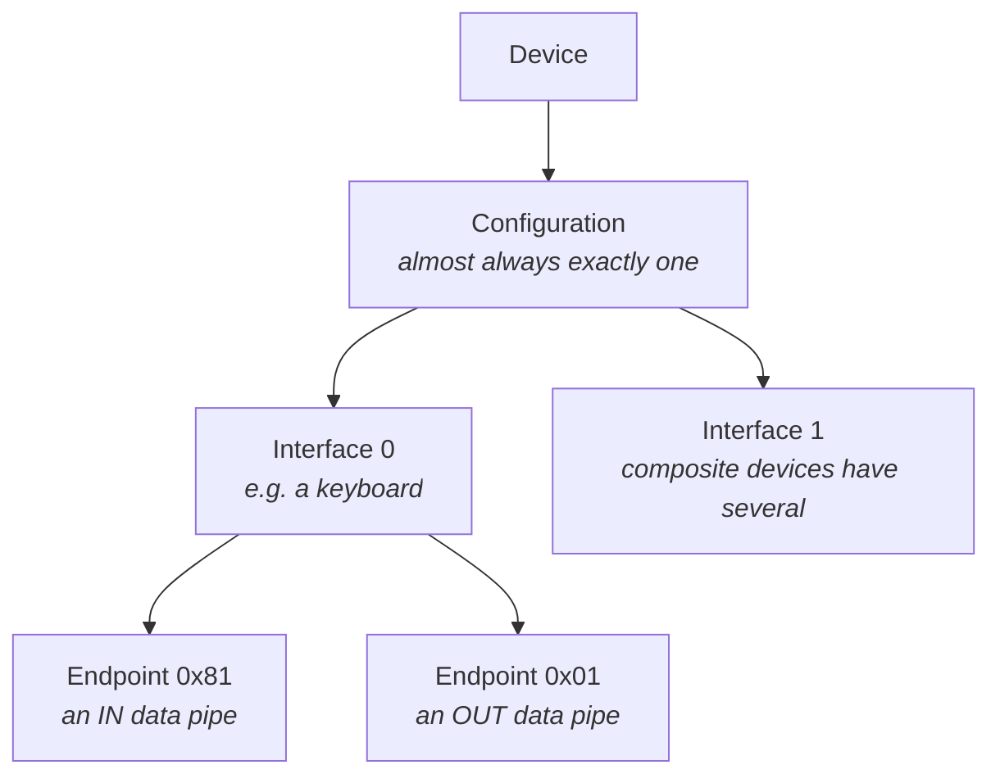

# USB concepts

A handful of USB terms show up throughout the docs and the API; this page explains
them. Each [device class](device/classes/index.md) hides most of the detail.

A USB device is a small tree:



- **Device** - the whole device, identified by a **VID:PID** (vendor & product IDs,
  e.g. `0x1209:0x0001`).
- **Configuration** - a set of interfaces that are active together. Nearly every device
  has one.
- **Interface** - one role: a keyboard, a serial port, a camera. An
  [`Interface`][usbip.function.Interface] in the Python library is exactly this.
- **Endpoint** - a one-way data pipe. The address encodes the number and direction:
  bit 7 set means **IN** (device → host), clear means **OUT** (host → device). So `0x81`
  is "endpoint 1, IN" and `0x01` is "endpoint 1, OUT". Endpoint `0` is special - it
  carries *control* transfers and always exists.

A **descriptor** is a small binary structure the device hands the host to describe
itself - there's a device descriptor, a configuration descriptor, one per interface and
endpoint, and **string descriptors** for human-readable text (manufacturer, product,
serial). The library builds these for you from the typed structs in the
[Core API](api/core.md) (`DeviceDescriptor`, `EndpointDescriptor`, …); a device class
fills them in automatically.

Every endpoint is one of four types, chosen for the kind of data:

| Type | Used for | Guarantees |
|------|----------|-----------|
| **Control** | setup, configuration, small commands (endpoint 0) | reliable, low volume |
| **Bulk** | large data with no timing needs (storage, serial) | reliable, no timing |
| **Interrupt** | small, periodic events (keyboards, mice) | bounded latency |
| **Isochronous** | streaming media (audio, video) | steady timing, *may drop* data |

Every **control transfer** begins with an 8-byte **SETUP packet** - the request the
host is making. In USBIP it's the [`Setup`][usbip.core.Setup] object (Python) /
`usb_setup` struct (C):

| Field | Meaning |
|-------|---------|
| `bmRequestType` | a **bitmask** describing the request (see below) |
| `bRequest` | the request code (e.g. `GET_DESCRIPTOR` = `0x06`) |
| `wValue`, `wIndex` | request-specific parameters |
| `wLength` | how many data bytes follow |

`bmRequestType` packs three things into one byte:

| Bit(s) | Field | Meaning |
|--------|-------|---------|
| 7 | dir | 0 = OUT, 1 = IN |
| 6–5 | type | 0 = standard, 1 = class, 2 = vendor |
| 4–0 | recipient | 0 = device, 1 = interface, 2 = endpoint |

So a few common values read as:

- `0x80` - IN, standard, device → e.g. "get the device descriptor".
- `0x21` - OUT, class, interface → e.g. a CDC "set line coding" or HID "set report".
- `0xA1` - IN, class, interface → e.g. HID "get report".

A device class answers the standard requests for you. When you implement a class or a
vendor device, you only handle the **class/vendor** requests - your `on_control`
callback receives the `Setup` and decides what to do.

If a device can't honour a request - it's unsupported, out of range, or the endpoint is
in a bad state - it returns a **STALL**: USB's way of saying "no". The host sees a pipe
error and, for endpoints, must clear the halt before using the pipe again.

In USBIP you signal a STALL on a **control** request by **raising
[`Stall`][usbip.core.Stall]** (Python) or **returning a negative value** from a control
handler (C). On the host side, a STALLed request surfaces as a `Stall` exception / a
pipe error code.

Other endpoints don't answer a request, so they **halt** instead: the endpoint STALLs
every transfer until the host sends `CLEAR_FEATURE(ENDPOINT_HALT)`, which the core
answers itself. A halt is how a device abandons a transfer it can't complete, instead
of leaving the host waiting for its timeout. Data already written to the endpoint
survives the halt and is delivered once it's cleared - mass storage relies on this to
halt a failed data phase and still report its status wrapper afterwards.

=== "Python"

    ```python
    ep.stall()                  # halt; every transfer STALLs from here
    ep.clear_halt()             # rarely needed - the host normally clears it
    handle.clear_halt(0x81)     # host side: recover a halted pipe
    ```

=== "C"

    ```c
    usbip_ep_stall(ep);                 /* halt; every transfer STALLs from here */
    usbip_ep_clear_halt(ep);            /* rarely needed - the host normally clears it */
    usbip_host_clear_halt(h, 0x81);     /* host side: recover a halted pipe */
    ```

The host API reports failures as numeric codes in C (`USB_ERROR_*`, the *same values as
libusb* so ported code keeps working - `usb_strerror()` renders them as text), and as
exceptions in Python, all subclasses of [`USBError`][usbip.core.USBError]:

- [`Stall`][usbip.core.Stall] - the device rejected the request / halted the endpoint.
- [`Timeout`][usbip.core.Timeout] - no response within the timeout.
- [`NotFound`][usbip.core.NotFound] - no matching device/endpoint.

Each class adds a few terms of its own; they're explained where they're used:

- **HID report & report descriptor**, **boot vs. report protocol**
  (`GET_PROTOCOL`/`SET_PROTOCOL`) → [Input Device (HID)](device/classes/hid.md).
- **Line coding / DTR** (serial) → [Serial Port (CDC-ACM)](device/classes/serial.md).
- **LBA / block** (storage) → [Disk Storage (MSC)](device/classes/storage.md).
- **HCI / ACL** (Bluetooth) → [Bluetooth Dongle (HCI)](device/classes/bluetooth.md).

USB/IP carries these transfers over TCP: your program answers URBs, and a
[client](platforms/index.md) on the importing machine replays them into a real USB
stack. The naming is inverted from USB's - see
[which end is the server](getting-started.md). The transport
has two practical consequences - no bus frame clock and a network round trip per
transfer - covered under [Hardware clients](platforms/hw-clients.md).
