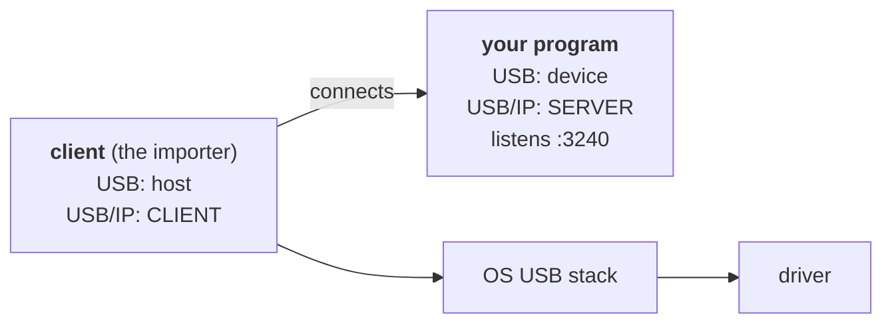

# USB/IP clients

A program built on this library is the USB/IP **server**: it *provides* a device and
listens on TCP 3240. Something else has to **import** it before an operating system
sees a USB device, and that importer is the USB/IP **client** - the OS's own, or
another process using the [host API](../host/host-driver.md). The client is not
part of this library.

(The role table in
[Getting Started](../getting-started.md) spells out the
inversion.) Listen where the client can reach you:
`dev.plug(via=usbip.USBIP("0.0.0.0", 3240))` binds every interface, while the default
local transport stays on the loopback, which a remote client can never reach.

| Platform | Client | Notes |
|----------|--------|-------|
| [Linux](linux.md) | built in (`vhci-hcd`) | the reference environment |
| [Windows](windows.md) | install one (`usbip-win2` / `usbip-win`) | in-box drivers bind afterwards |
| [macOS](macos.md) | none in-box; one experimental one needing SIP off | prefer a [hardware client](hw-clients.md), or drive with the host API |
| [Hardware clients](hw-clients.md) | vendor-specific | any importer speaking the protocol - and the practical answer on macOS |
| No client at all | - | the [host API](../host/host-driver.md) imports and drives the device itself, on any OS |
